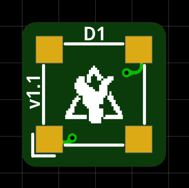
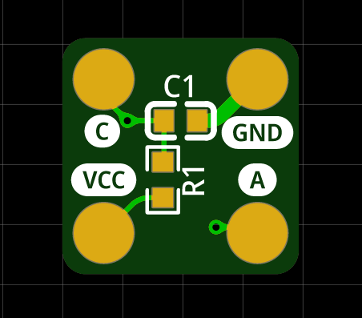

# Tiny MicroFC SiPM Carrier Board

Tiny carrier board for a 6 mm C-Series MICROFC-60035-SMT silicon photomultiplier by [onsemi](https://www.onsemi.com/pdf/datasheet/microc-series-d.pdf) designed specifically to work with the [Open Gamma Detector](https://github.com/OpenGammaProject/Open-Gamma-Detector), but can be used with any other system.

PCB size is 10 x 10 mm. The solder pads for the SiPM are slightly bigger than they need to so that you can easily hand-solder everything! You can get some PCBs on my [Tindie store](https://www.tindie.com/products/31304/) for cheap. You also can buy all the parts and the PCB using [Kitspace](https://kitspace.org/boards/github.com/opengammaproject/Tiny-MicroFC-Carrier-Board/). It is advised to panelize the design if your manufacturer of choice adds an extra fee for the small size.

  
  

On the front side there is only the sensor itself while all the other parts are on the back. This ensures good optical contact and light-tight sealing.

The PCB includes an RC low-pass filter that is optional to use. Use it by mounting the two 0603 components, then soldering wires to the `VCC` and `GND` pads respectively. The SiPM signal will then be the anode `A` pad. Do not solder anything to the cathode pad in this case.

If you are connecting straight to the SiPM, do so via the cathode `C` and anode `A` pads. You do not need the GND pad in that case.

  

